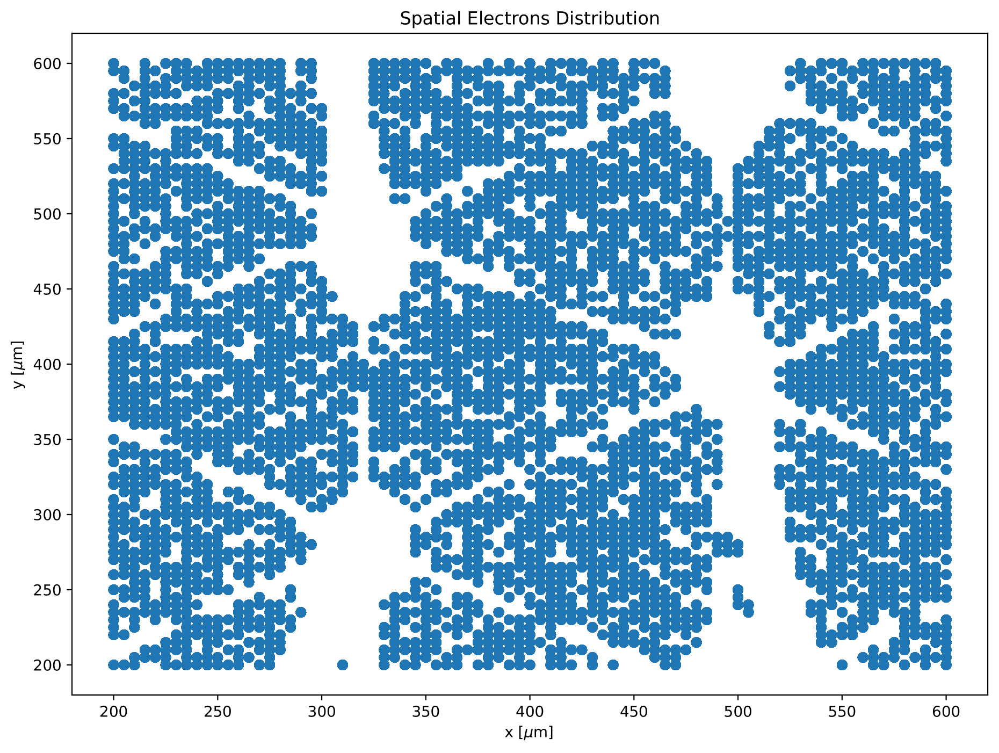
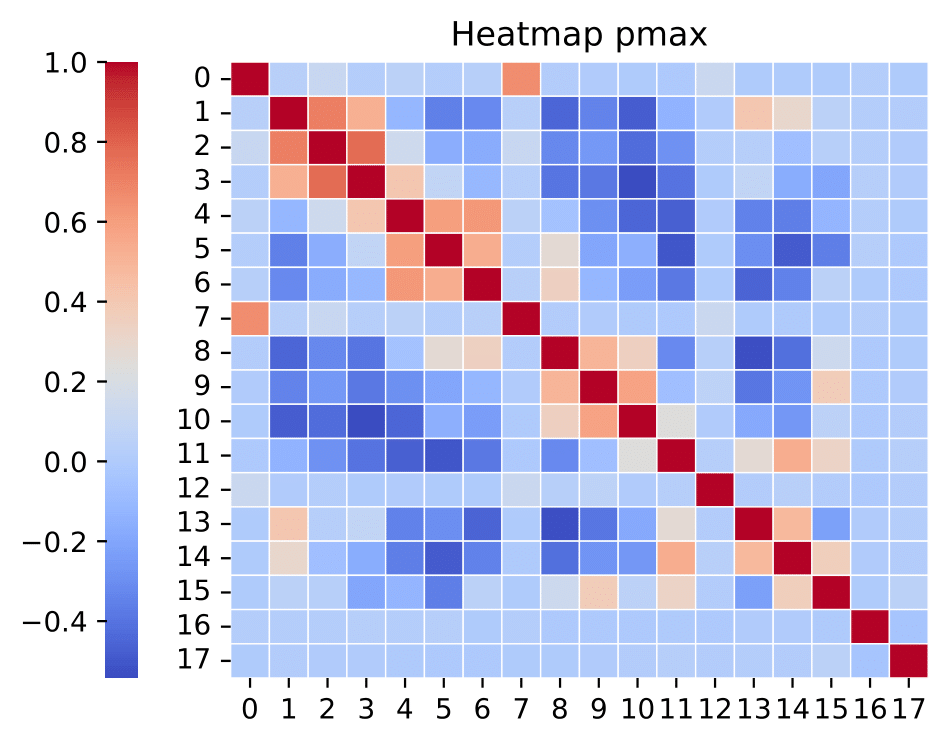
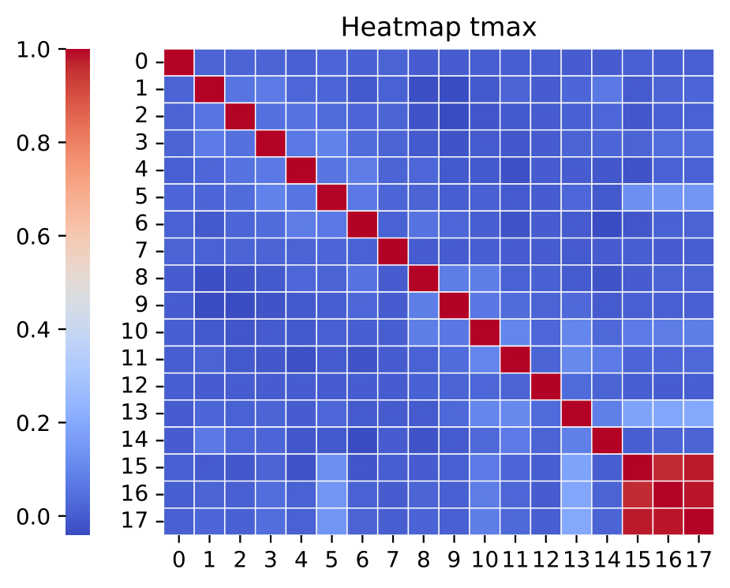
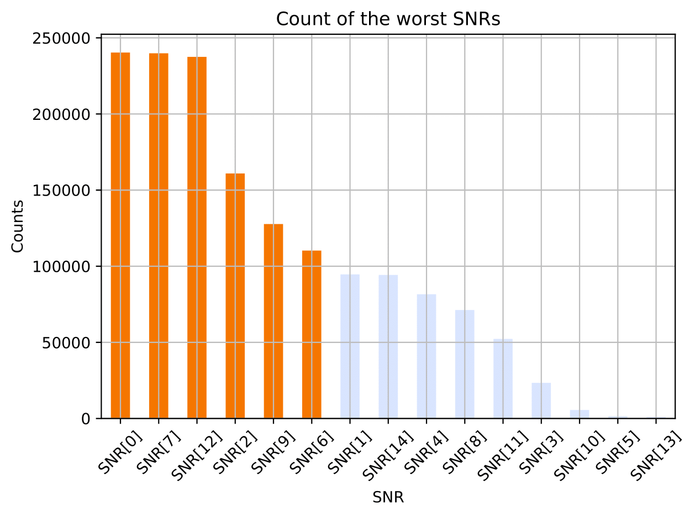

# Particle Passage Detector Dataset Regression Problem

## Overview

This repository contains the code and report for the Particle Passage Detector regression problem, developed as part of a data science project at Politecnico di Torino. The goal of this project is to predict the (x, y) coordinates of particles passing through a detector, based on signal measurements from a series of pads.

The dataset used in this project contains measurements from 18 pads, each of which provides 5 features related to the signal detected. The challenge is to build a robust regression model that accurately predicts the particle positions while dealing with the noise present in some of the pads.

## Dataset

The dataset consists of two main parts:

- **Development set**: 385,500 events.
- **Evaluation set**: 128,500 events.

Each event includes 90 features (5 per pad). Notably, some pads are not physically connected to the Resistive Silicon Detector (RSD), making their data purely noise.

## Problem Statement

The task is to build a data science pipeline that predicts the (x, y) coordinates of particle passage based on the signal characteristics measured by the pads. The main challenges are handling the noise in the dataset and selecting the most relevant features.

## Approach

### Preprocessing

Two different preprocessing approaches were explored:

1. **Correlation-based preprocessing**:
   - Heatmaps were generated to evaluate the correlation between features. This method helped identify and exclude the noisy pads, reducing the feature set from 90 to 60.
   - 
   - 

2. **Signal-to-Noise Ratio (SNR) preprocessing**:
   - SNR was calculated for each pad, and the pads with the lowest SNR values were excluded.
   - 

### Dimensionality Reduction

Principal Component Analysis (PCA) was performed on the SNR-preprocessed data to further reduce dimensionality while retaining over 90% of the variance.

### Model Selection

A Random Forest Regressor was selected due to its robustness to noisy data and its ability to handle complex interactions between features. Hyperparameters were tuned to optimize performance, with a focus on minimizing the Euclidean distance between predicted and actual particle positions.

## Results

The best results were obtained using the correlation-based preprocessing method, with a public score of 5.112 µm. The SNR preprocessing method, even after applying PCA, yielded higher error rates due to the approximations made during SNR calculation.

### Summary of Results

| Preprocess Method    | min samples leaf | min samples split | Public Score  |
|----------------------|------------------|-------------------|---------------|
| Correlation          | 2                | 4                 | **5.112 µm**  |
| SNR                  | 2                | 4                 | 163.566 µm    |
| PCA on SNR           | 2                | 2                 | 114.967 µm    |

### Feature Importance

It was found that the `rms` and `tmax` features contributed little to the overall prediction accuracy, and excluding these features led to a slight improvement in the public score.

## Conclusion

The project demonstrates the importance of careful feature selection and preprocessing in building accurate regression models. Future work could explore additional signal processing techniques and further hyperparameter tuning to improve the model's performance.

## Report

For a detailed explanation of the methodologies and results, please refer to the [report](s331438_report_winter.pdf).

## How to Use

1. Clone the repository.
2. Install the required packages using `pip install -r requirements.txt`.
3. Run the notebook `scratch_code.ipynb` to train the model and generate predictions.

## Acknowledgments

This project was developed as part of a course at Politecnico di Torino. Special thanks to the course instructors and fellow students for their support.
